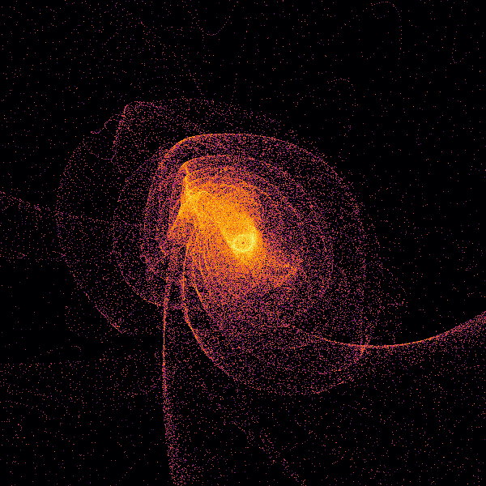
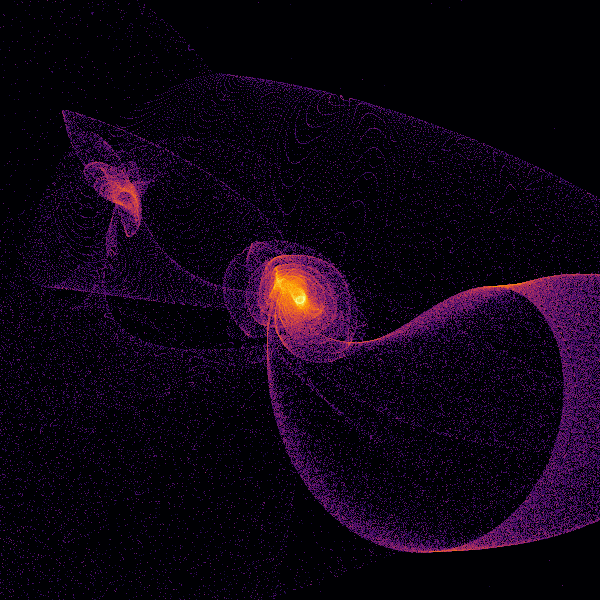

# nbody-viz

Visualizations of n-body flyby simulations.

Needs a dataset in CSV format with the columns `time`, `id`, `mass`, `x`, `y`,
`z`, `vx`, `vy`, `vz`, `source` saved in the folder `/data`.

Produces plots like these, computed from the dataset `simdata_ias15.csv`:





## Installation

This project uses Python 3.12 or later and the [uv package
manager](https://github.com/astral-sh/uv). To install the project, run:

```bash
uv venv
```

## Usage

To run the project:

```bash
uv run src/main.py
```
